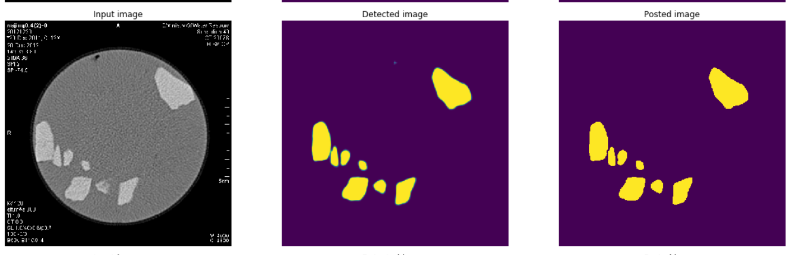
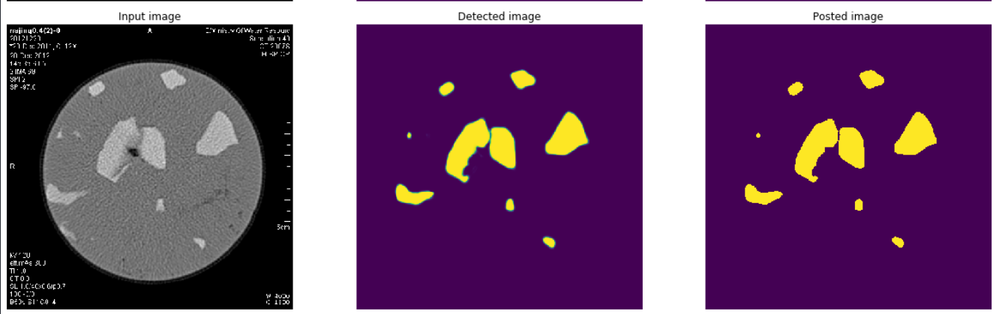
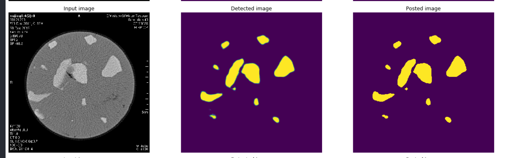
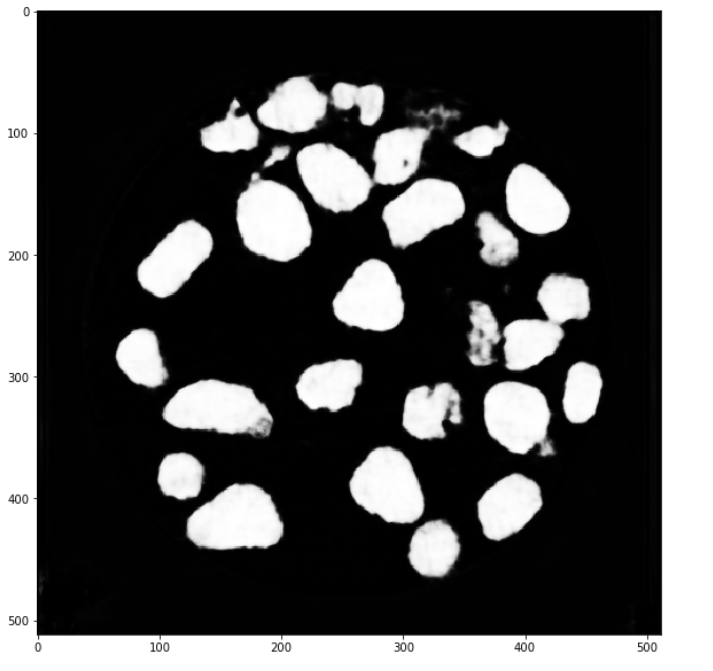
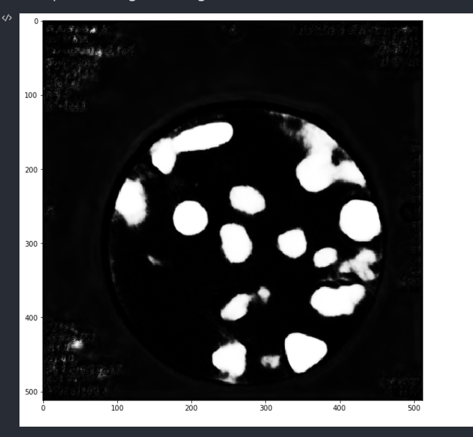
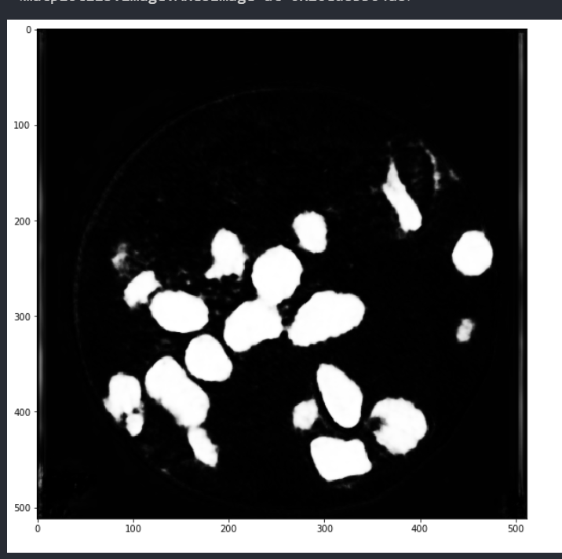

# 2021/9/28 学习汇报总结

## U-Net

- **解决什么问题？**

  - 医学图像的分割
  - 对小数据集十分友好

- **U-Net使用的方法？**

  - 整体结构就是**先编码（下采样）， 再解码（上采样）**，回归到跟原始图像一样大小的像素点的分类。
  - 继承FCN的思想，继续进行改进。但是相对于FCN，有几个改变的地方，U-Net是完全对称的，且对解码器（应该自Hinton提出编码器、解码器的概念来，即将**图像->高语义**feature map的过程看成**编码器**，**高语义->像素级别**的分类score map的过程看作**解码器**）进行了加卷积加深处理，FCN只是单纯的进行了上采样。

  - **Skip connection**：两者都用了这样的结构，虽然在现在看来这样的做法比较常见，但是对于当时，这样的结构所带来的明显好处是有目共睹的，因为可以**联合高层语义和低层的细粒度表层信息**，就很好的符合了分割对这两方面信息的需求。
  - 联合：在FCN中，Skip connection的联合是通过对应像素的求和，而U-Net则是对其的channel的concat过程。

### 效果

- **CELoss + dice_loss**，使用vgg16预训练权重；训练集：验证集 = 9：1；base_lr = 1e-4,StepLR学习率衰减器；batch_size = 2; epoch = 50。

- **Boundary Loss + Dice Loss**，权重衰减法，alpha from 1 => 0.01,使用vgg16预训练权重；训练集：验证集 = 9：1；base_lr = 1e-4,StepLR学习率衰减器；batch_size = 2; epoch = 50。

## U-Net++

### 效果

