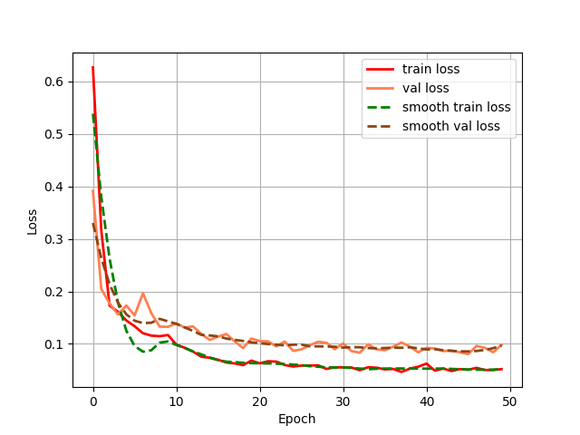
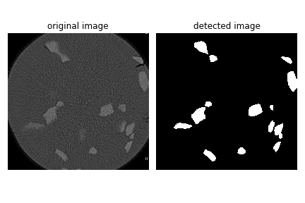
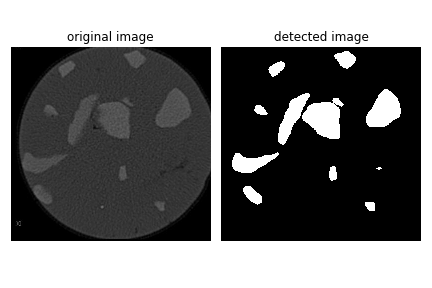
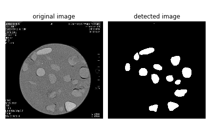
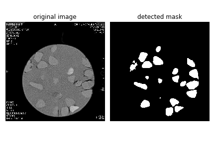
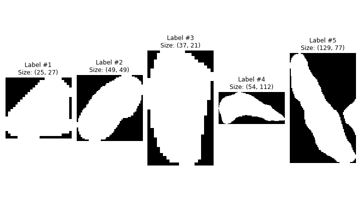

# Unet：U-Net: Convolutional Networks for Biomedical Image Segmentation语义分割模型在Pytorch当中的实现
## 性能情况
**U-Net并不适合VOC此类数据集，其更适合特征少，需要浅层特征的医药数据集(CT-soil-rock-mixture)。**

| 训练数据集 | 测试数据集 | 输入图片大小 | mIOU |
| :-----: | :------: | :------: | :------: |
| VOC12+SBD | VOC-Val12 | 512x512| 55.11 |
| **CT-soil-rock-mixture** | **CT-soil-rock-mixture** | 512x512 | **92.01** |

## 所需环境
- scipy==1.2.1
- numpy==1.17.0
- matplotlib==3.1.2
- opencv_python==4.1.2.30
- torch==1.2.0
- torchvision==0.4.0
- tqdm==4.60.0
- Pillow==8.2.0
- h5py==2.10.0

## 目前效果展示

**训练过程损失变化曲线图**：

**训练数据集说明**：

格式：VOC

由于数据集标注的困难，并且无法使用之前标注了部分的Mask R-CNN 实例分割数据集，本次仅使用30张语义分割图像，数据增强到100张进行训练，得到的效果较好。

## U-Net

自2015年以来，在生物医学图像分割领域，U-Net得到了广泛的应用，目前已达到四千多次引用。

这个模型非常优雅，结构对称，全是卷积层，没有全连接。

因为这个网络使用更少的数据，取得更好的效果

所以我们修改并扩展这个网络。

全卷积网络其实就是一个不断缩小特征图的卷积神经网络，只不过后面的一些层中，将pooling层换为unsampling操作了。

为了使得分割结果更加精确，将高分辨率的特征图与与上采样后的低分辨率特征图进行合并。因此，分割结果就更加准确。

## CT数据集特点

- 图像语义较为简单、结构较为固定。由于砾石结构固定和语义信息没有特别丰富，所以高级语义信息和低级特征都显得很重要。
- 数据量少。医学影像的数据获取相对难一些。所以我们设计的模型不宜多大，参数过多，很容易导致过拟合。

## <u>如何解决医学图像的数据非常少的问题？</u>

- 所以需要使用大量的数据增强，意思是在不实质性的增加数据的情况下，让有限的数据产生等价于更多数据的价值。
- **数据增强**：几何变换、噪声、模糊、填充、亮度等等。

## *<u>如何解决目标粘连问题？</u>*

- 图像形态学操作？开运算，凸性分析......
- 使用一个加权loss,使细胞之间的**缝隙**有较大的训练权重，是否可行？

## 如何训练数据集
1. 本文使用`VOC格式`进行训练。  
2. 使用`lableme`制作自己的数据集，将图片和json文件放在`dataset/before`中，运行`json_to_dataset.py`。
3. 训练前将标签文件放在`VOCdevkit`文件夹下的`VOC2007`文件夹下的`SegmentationClass`中。    
4. 训练前将图片文件放在`VOCdevkit`文件夹下的`VOC2007`文件夹下的`JPEGImages`中。    
5. 在训练前利用`voc2unet.py`文件生成对应的txt。
6. 注意修改`train.py`的`num_classes`为分类个数+1。  
7. 运行`train.py`即可开始训练。  

## Reference
https://github.com/bubbliiiing/unet-pytorch

https://zhuanlan.zhihu.com/p/370931792

https://lmb.informatik.uni-freiburg.de/people/ronneber/u-net/

https://github.com/JlexZhong/pytorch-U-Net
