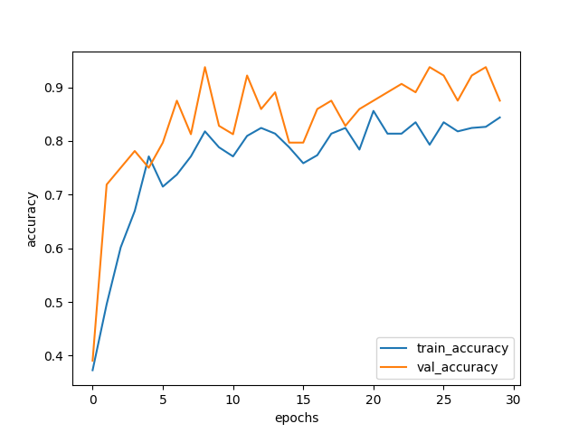
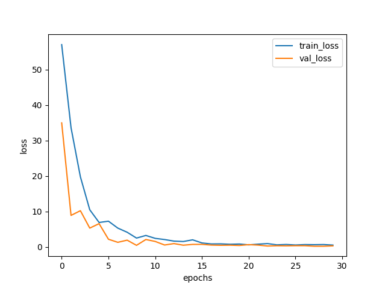
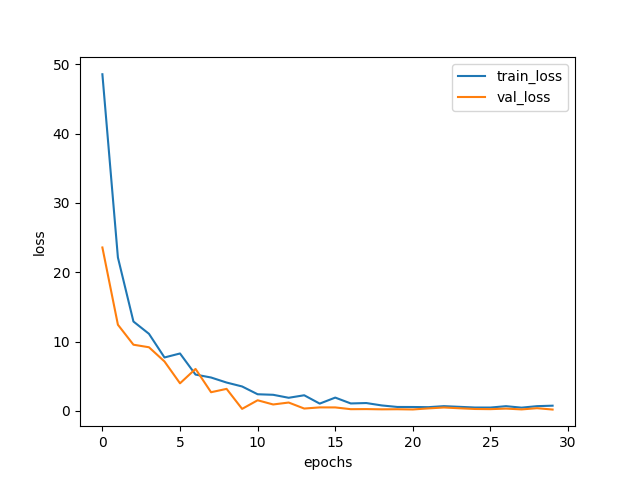
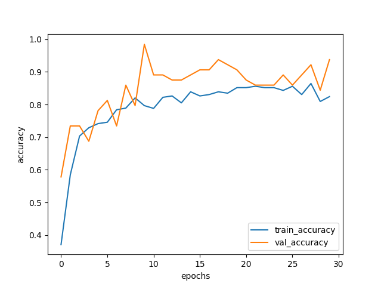
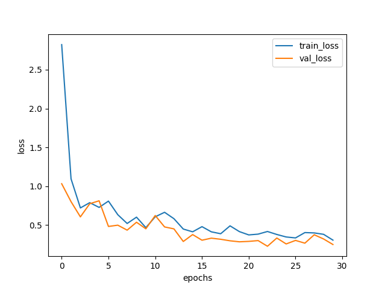
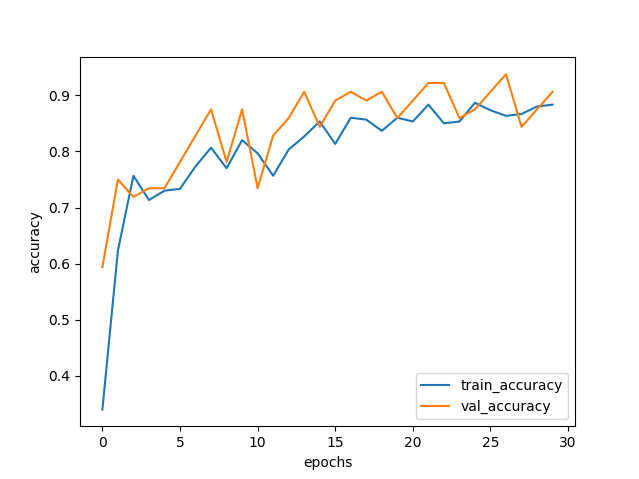
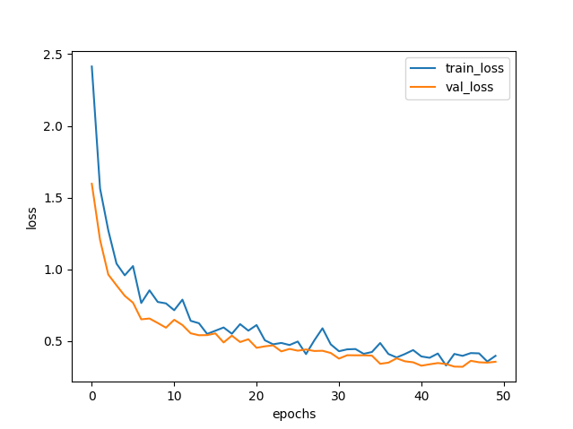
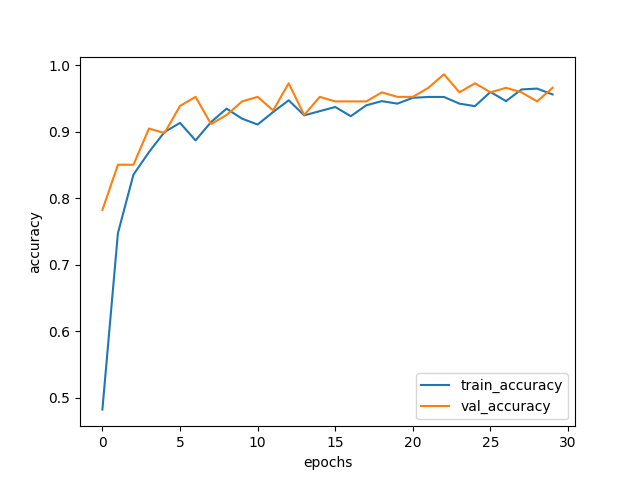

# inception-resnet-v2优化笔记

## csdn岩石数据集

### 1

```
    image_size = 299
    batch_size = 32
    num_train = 250
    num_val = 50
    epochs = 30
	model.compile(loss=tf.keras.losses.CategoricalCrossentropy(from_logits=False),  # BUG：交叉熵损失函数
                      optimizer=tf.keras.optimizers.Adam(lr=0.001, beta_1=0.9, beta_2=0.999),  
                      metrics=['accuracy'])
    x = layers.Dropout(0.5)(x)
```





## 2

在1的基础上

```
x = layers.Dropout(0.4)(x)
reduce_lr =  tf.keras.callbacks.ReduceLROnPlateau(monitor='val_loss', patience=15,  verbose=1,mode='auto')
```





### 3

```
x = layers.Dropout(0.3)(x)
lr=0.001, decay=0.0002, momentum=0.9
sgd = SGD(lr=lr, decay=decay, momentum=momentum, nesterov=True)
print('================编译模型=================')
        
model.compile(loss=tf.keras.losses.CategoricalCrossentropy(from_logits=False),  # BUG：交叉熵损失函数
        optimizer=sgd,  #tf.keras.optimizers.Adam(lr=0.001, beta_1=0.9, beta_2=0.999)
        metrics=['accuracy'])
# 动态更改学习率
reduce_lr =  tf.keras.callbacks.ReduceLROnPlateau()
        
```




## scidbk镜下矿物薄片图像数据集

### 1

```python
总计：989
train:796
val:147
test:46

lr=0.001, decay=0.0002, momentum=0.9
sgd = SGD(lr=lr, decay=decay, momentum=momentum, nesterov=True)
reduce_lr =  tf.keras.callbacks.ReduceLROnPlateau()
x = layers.Dropout(0.4)(x)
```

```

24/24 [==============================] - 374s 14s/step - loss: 2.1553 - accuracy: 0.4824 - val_loss: 0.7156 - val_accuracy: 0.7823
Epoch 2/30
24/24 [==============================] - 352s 14s/step - loss: 0.7679 - accuracy: 0.7475 - val_loss: 0.3818 - val_accuracy: 0.8503
Epoch 3/30
24/24 [==============================] - 290s 12s/step - loss: 0.4792 - accuracy: 0.8354 - val_loss: 0.3833 - val_accuracy: 0.8503
Epoch 4/30
24/24 [==============================] - 280s 11s/step - loss: 0.3891 - accuracy: 0.8693 - val_loss: 0.2691 - val_accuracy: 0.9048
Epoch 5/30
24/24 [==============================] - 331s 13s/step - loss: 0.2923 - accuracy: 0.8995 - val_loss: 0.2480 - val_accuracy: 0.8980
Epoch 6/30
24/24 [==============================] - 371s 15s/step - loss: 0.2635 - accuracy: 0.9133 - val_loss: 0.1679 - val_accuracy: 0.9388
Epoch 7/30
24/24 [==============================] - 374s 15s/step - loss: 0.3156 - accuracy: 0.8869 - val_loss: 0.1656 - val_accuracy: 0.9524
Epoch 8/30
24/24 [==============================] - 355s 14s/step - loss: 0.2576 - accuracy: 0.9146 - val_loss: 0.2341 - val_accuracy: 0.9116
Epoch 9/30
24/24 [==============================] - 365s 15s/step - loss: 0.2239 - accuracy: 0.9347 - val_loss: 0.1897 - val_accuracy: 0.9252
Epoch 10/30
24/24 [==============================] - 320s 13s/step - loss: 0.2377 - accuracy: 0.9196 - val_loss: 0.1559 - val_accuracy: 0.9456
Epoch 11/30
24/24 [==============================] - 289s 12s/step - loss: 0.2157 - accuracy: 0.9108 - val_loss: 0.1439 - val_accuracy: 0.9524
Epoch 12/30
24/24 [==============================] - 288s 12s/step - loss: 0.1980 - accuracy: 0.9296 - val_loss: 0.1760 - val_accuracy: 0.9320
Epoch 13/30
24/24 [==============================] - 288s 12s/step - loss: 0.1712 - accuracy: 0.9472 - val_loss: 0.1125 - val_accuracy: 0.9728
Epoch 14/30
24/24 [==============================] - 289s 12s/step - loss: 0.2244 - accuracy: 0.9246 - val_loss: 0.1753 - val_accuracy: 0.9252
Epoch 15/30
24/24 [==============================] - 290s 12s/step - loss: 0.2167 - accuracy: 0.9309 - val_loss: 0.1282 - val_accuracy: 0.9524
Epoch 16/30
24/24 [==============================] - 292s 12s/step - loss: 0.1749 - accuracy: 0.9372 - val_loss: 0.1213 - val_accuracy: 0.9456
Epoch 17/30
24/24 [==============================] - 300s 12s/step - loss: 0.2063 - accuracy: 0.9234 - val_loss: 0.1781 - val_accuracy: 0.9456
Epoch 18/30
24/24 [==============================] - 364s 15s/step - loss: 0.1768 - accuracy: 0.9397 - val_loss: 0.1639 - val_accuracy: 0.9456
Epoch 19/30
24/24 [==============================] - 357s 14s/step - loss: 0.1618 - accuracy: 0.9460 - val_loss: 0.1257 - val_accuracy: 0.9592
Epoch 20/30
24/24 [==============================] - 553s 22s/step - loss: 0.1960 - accuracy: 0.9422 - val_loss: 0.1187 - val_accuracy: 0.9524
Epoch 21/30
24/24 [==============================] - 355s 14s/step - loss: 0.1456 - accuracy: 0.9510 - val_loss: 0.1159 - val_accuracy: 0.9524
Epoch 22/30
24/24 [==============================] - 382s 15s/step - loss: 0.1256 - accuracy: 0.9523 - val_loss: 0.0699 - val_accuracy: 0.9660
Epoch 23/30
24/24 [==============================] - 356s 14s/step - loss: 0.1445 - accuracy: 0.9523 - val_loss: 0.0798 - val_accuracy: 0.9864
Epoch 24/30
24/24 [==============================] - 377s 15s/step - loss: 0.1284 - accuracy: 0.9422 - val_loss: 0.1049 - val_accuracy: 0.9592
Epoch 25/30
24/24 [==============================] - 344s 14s/step - loss: 0.1593 - accuracy: 0.9384 - val_loss: 0.1042 - val_accuracy: 0.9728
Epoch 26/30
24/24 [==============================] - 380s 15s/step - loss: 0.1241 - accuracy: 0.9598 - val_loss: 0.1363 - val_accuracy: 0.9592
Epoch 27/30
24/24 [==============================] - 367s 15s/step - loss: 0.1538 - accuracy: 0.9460 - val_loss: 0.1196 - val_accuracy: 0.9660
Epoch 28/30
24/24 [==============================] - 378s 15s/step - loss: 0.0946 - accuracy: 0.9636 - val_loss: 0.0695 - val_accuracy: 0.9592
Epoch 29/30
24/24 [==============================] - 366s 15s/step - loss: 0.1100 - accuracy: 0.9648 - val_loss: 0.1312 - val_accuracy: 0.9456
Epoch 30/30
24/24 [==============================] - 368s 14s/step - loss: 0.1270 - accuracy: 0.9560 - val_loss: 0.0658 - val_accuracy: 0.9660
```





## 数据集8类（较少），ResNet152V2。adam默认优化器

```python
x = base_model.output
#添加自己的全链接分类层

x = layers.GlobalAveragePooling2D()(x)
x = layers.Dense(1024, activation='relu')(x)
predictions = layers.Dense(nb_classes, activation='softmax')(x)

#训练模型
model = Model(inputs=base_model.input, outputs=predictions)
```

**log：**

```bash
================开始训练================
Epoch 1/40
17/17 [==============================] - 57s 3s/step - loss: 2.3270 - accuracy: 0.4007 - val_loss: 0.7884 - val_accuracy: 0.7015
Epoch 2/40
17/17 [==============================] - 49s 3s/step - loss: 1.0187 - accuracy: 0.6690 - val_loss: 0.6000 - val_accuracy: 0.8209
Epoch 3/40
17/17 [==============================] - 50s 3s/step - loss: 0.7642 - accuracy: 0.7404 - val_loss: 0.5888 - val_accuracy: 0.7761
Epoch 4/40
17/17 [==============================] - 50s 3s/step - loss: 0.7589 - accuracy: 0.7265 - val_loss: 0.4681 - val_accuracy: 0.8507
Epoch 5/40
17/17 [==============================] - 50s 3s/step - loss: 0.5989 - accuracy: 0.7875 - val_loss: 0.5043 - val_accuracy: 0.8507
Epoch 6/40
17/17 [==============================] - 49s 3s/step - loss: 0.5459 - accuracy: 0.7997 - val_loss: 0.5242 - val_accuracy: 0.8507
Epoch 7/40
17/17 [==============================] - 50s 3s/step - loss: 0.4877 - accuracy: 0.8397 - val_loss: 0.5059 - val_accuracy: 0.8209
Epoch 8/40
17/17 [==============================] - 49s 3s/step - loss: 0.5193 - accuracy: 0.8136 - val_loss: 0.2059 - val_accuracy: 0.9254
Epoch 9/40
17/17 [==============================] - 50s 3s/step - loss: 0.4585 - accuracy: 0.8345 - val_loss: 0.3750 - val_accuracy: 0.8507
Epoch 10/40
17/17 [==============================] - 50s 3s/step - loss: 0.4579 - accuracy: 0.8519 - val_loss: 0.3463 - val_accuracy: 0.8657
Epoch 11/40
17/17 [==============================] - 50s 3s/step - loss: 0.3721 - accuracy: 0.8676 - val_loss: 0.1566 - val_accuracy: 0.9254
Epoch 12/40
17/17 [==============================] - 50s 3s/step - loss: 0.3437 - accuracy: 0.8815 - val_loss: 0.5633 - val_accuracy: 0.8358
Epoch 13/40
17/17 [==============================] - 50s 3s/step - loss: 0.4076 - accuracy: 0.8519 - val_loss: 0.2954 - val_accuracy: 0.9104
Epoch 14/40
17/17 [==============================] - 50s 3s/step - loss: 0.4405 - accuracy: 0.8449 - val_loss: 0.2551 - val_accuracy: 0.8806
Epoch 15/40
17/17 [==============================] - 50s 3s/step - loss: 0.3651 - accuracy: 0.8571 - val_loss: 0.3771 - val_accuracy: 0.8657
Epoch 16/40
17/17 [==============================] - 50s 3s/step - loss: 0.4123 - accuracy: 0.8659 - val_loss: 0.2305 - val_accuracy: 0.8806
Epoch 17/40
17/17 [==============================] - 49s 3s/step - loss: 0.3828 - accuracy: 0.8676 - val_loss: 0.3204 - val_accuracy: 0.9403
Epoch 18/40
17/17 [==============================] - 50s 3s/step - loss: 0.3089 - accuracy: 0.9059 - val_loss: 0.2343 - val_accuracy: 0.8955
Epoch 19/40
17/17 [==============================] - 50s 3s/step - loss: 0.4013 - accuracy: 0.8537 - val_loss: 0.2916 - val_accuracy: 0.8955
Epoch 20/40
17/17 [==============================] - 49s 3s/step - loss: 0.3247 - accuracy: 0.8693 - val_loss: 0.1626 - val_accuracy: 0.9403
Epoch 21/40
17/17 [==============================] - 50s 3s/step - loss: 0.3564 - accuracy: 0.8659 - val_loss: 0.2356 - val_accuracy: 0.9403
Epoch 22/40
17/17 [==============================] - 49s 3s/step - loss: 0.3821 - accuracy: 0.8589 - val_loss: 0.3760 - val_accuracy: 0.8657
Epoch 23/40
17/17 [==============================] - 50s 3s/step - loss: 0.3681 - accuracy: 0.8676 - val_loss: 0.2977 - val_accuracy: 0.8955
Epoch 24/40
17/17 [==============================] - 49s 3s/step - loss: 0.3279 - accuracy: 0.8850 - val_loss: 0.2885 - val_accuracy: 0.8955
Epoch 25/40
17/17 [==============================] - 50s 3s/step - loss: 0.2966 - accuracy: 0.8728 - val_loss: 0.3733 - val_accuracy: 0.8507
Epoch 26/40
17/17 [==============================] - 49s 3s/step - loss: 0.3201 - accuracy: 0.8868 - val_loss: 0.1600 - val_accuracy: 0.9701
Epoch 27/40
17/17 [==============================] - 50s 3s/step - loss: 0.3249 - accuracy: 0.8833 - val_loss: 0.1363 - val_accuracy: 0.9403
Epoch 28/40
17/17 [==============================] - 49s 3s/step - loss: 0.3399 - accuracy: 0.8763 - val_loss: 0.2085 - val_accuracy: 0.9254
Epoch 29/40
17/17 [==============================] - 50s 3s/step - loss: 0.2448 - accuracy: 0.9233 - val_loss: 0.2178 - val_accuracy: 0.9104
Epoch 30/40
17/17 [==============================] - 49s 3s/step - loss: 0.2751 - accuracy: 0.8955 - val_loss: 0.3133 - val_accuracy: 0.8806
Epoch 31/40
17/17 [==============================] - 49s 3s/step - loss: 0.2704 - accuracy: 0.8920 - val_loss: 0.1331 - val_accuracy: 0.9552
Epoch 32/40
17/17 [==============================] - 50s 3s/step - loss: 0.3623 - accuracy: 0.8868 - val_loss: 0.1144 - val_accuracy: 0.9552
Epoch 33/40
17/17 [==============================] - 49s 3s/step - loss: 0.2863 - accuracy: 0.8798 - val_loss: 0.1851 - val_accuracy: 0.9403
Epoch 34/40
17/17 [==============================] - 50s 3s/step - loss: 0.2935 - accuracy: 0.9059 - val_loss: 0.1641 - val_accuracy: 0.9552
Epoch 35/40
17/17 [==============================] - 49s 3s/step - loss: 0.2440 - accuracy: 0.9146 - val_loss: 0.2485 - val_accuracy: 0.9254
Epoch 36/40
17/17 [==============================] - 50s 3s/step - loss: 0.2578 - accuracy: 0.9111 - val_loss: 0.1363 - val_accuracy: 0.9552
Epoch 37/40
17/17 [==============================] - 50s 3s/step - loss: 0.2798 - accuracy: 0.9042 - val_loss: 0.1749 - val_accuracy: 0.9403
Epoch 38/40
17/17 [==============================] - 50s 3s/step - loss: 0.2619 - accuracy: 0.9077 - val_loss: 0.2854 - val_accuracy: 0.8955
Epoch 39/40
17/17 [==============================] - 49s 3s/step - loss: 0.1995 - accuracy: 0.9303 - val_loss: 0.1245 - val_accuracy: 0.9851
Epoch 40/40
17/17 [==============================] - 50s 3s/step - loss: 0.2499 - accuracy: 0.9111 - val_loss: 0.2573 - val_accuracy: 0.9254
================保存模型================
```

计算中断未获取到acc-loss图。

